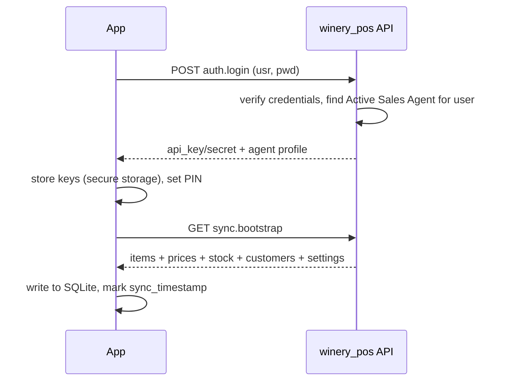
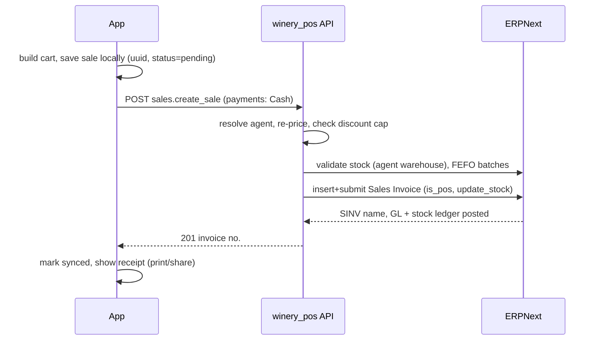
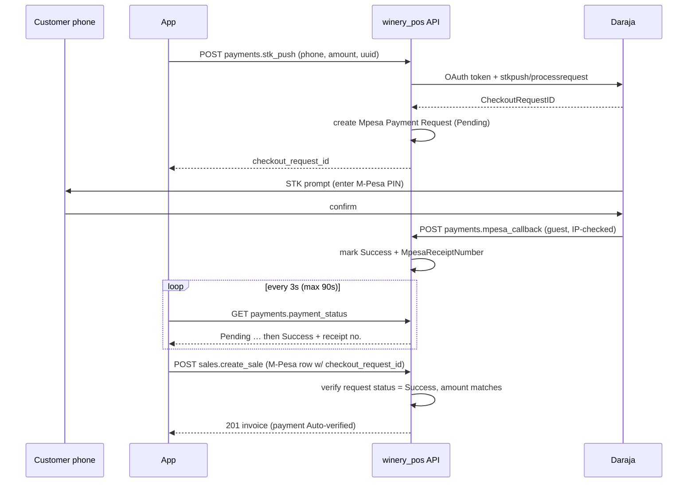
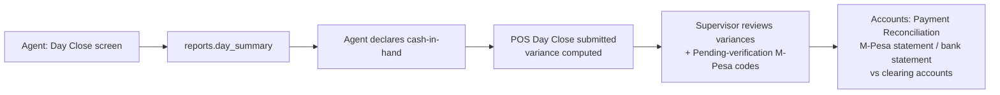

# Winery Sales Agent POS — Technical Documentation

| | |
|---|---|
| **Product** | Winery Sales Agent POS (Flutter mobile app + `winery_pos` Frappe app) |
| **Backend** | Frappe v16 / ERPNext v16 (`winery.finesoftafrika.com`) |
| **Status** | Design specification (pre-implementation) |
| **Version** | 1.0 — 2026-07-04 |

---

## Table of Contents

1. [Overview](#1-overview)
2. [System Architecture](#2-system-architecture)
3. [Backend Design (winery_pos)](#3-backend-design-winery_pos)
4. [API Documentation](#4-api-documentation)
5. [Flutter App Architecture](#5-flutter-app-architecture)
6. [App Pages](#6-app-pages)
7. [Process Flows](#7-process-flows)
8. [Security](#8-security)
9. [Error Handling & Status Codes](#9-error-handling--status-codes)

---

## 1. Overview

Field sales agents carry finished winery products (batch-tracked bottled wine) in a
dedicated per-agent warehouse and sell to customers in the field. Every sale is recorded
as a **POS Sales Invoice** in ERPNext with a payment split across **Cash**, **M-Pesa**
(Daraja STK Push or manual code), and **Bank** (deposit/transfer reference).

The mobile app is **offline-first**: sales are saved locally and synced when connectivity
returns. The server is the single source of truth — stock validation, pricing, discount
caps, and batch selection are all enforced server-side.

> **Note:** the existing `Agent` doctype in the `winery` app is for **procurement**
> (banana purchasing from farmers) and is not used here. Sales agents are modelled by a
> new `Sales Agent` doctype in the `winery_pos` app.

### Scope (v1)

- Agent login (API key/secret) + in-app PIN lock
- Product catalogue with live agent-warehouse stock
- Cart, line discounts (server-capped), checkout with split payments
- M-Pesa STK Push with live confirmation; manual M-Pesa code and bank reference fallbacks
- Offline sales queue with idempotent sync
- Receipt printing (Bluetooth ESC/POS) and PDF sharing
- Sales history, my-stock view, day-close summary

### Out of scope (v1)

Returns/credit notes, customer credit sales, multi-currency, agent-to-agent stock
transfers, in-app stock receiving confirmation (phase 2).

---

## 2. System Architecture

### 2.1 High-level diagram

```
┌──────────────────────────────┐                        ┌─────────────────────────────────┐
│ Flutter App (Android-first)  │                        │ Frappe Bench (v16)              │
│                              │  HTTPS REST            │                                 │
│  ┌────────────────────────┐  │  token: api_key:secret │  ┌───────────────────────────┐  │
│  │ Presentation (screens) │  │ ─────────────────────▶ │  │ winery_pos (NEW app)      │  │
│  ├────────────────────────┤  │  /api/method/          │  │  api/   (whitelisted)     │  │
│  │ State (Riverpod)       │  │    winery_pos.api.*    │  │  doctype/                 │  │
│  ├────────────────────────┤  │                        │  │   ├ Sales Agent           │  │
│  │ Domain (use-cases)     │  │ ◀───────────────────── │  │   ├ Mpesa Settings        │  │
│  ├────────────────────────┤  │  JSON responses        │  │   ├ Mpesa Payment Request │  │
│  │ Data                   │  │                        │  │   └ POS Day Close         │  │
│  │  ├ dio API client      │  │                        │  └───────────┬───────────────┘  │
│  │  ├ Drift (SQLite)      │  │                        │              │ standard docs    │
│  │  └ Sync queue          │  │                        │  ┌───────────▼───────────────┐  │
│  └────────────────────────┘  │                        │  │ ERPNext core              │  │
│  Bluetooth ESC/POS printer   │                        │  │  Sales Invoice (is_pos)   │  │
└──────────────────────────────┘                        │  │  Stock Ledger / Batch     │  │
                                                        │  │  Mode of Payment / GL     │  │
        ┌─────────────────┐   STK Push (OAuth2 + REST)  │  └───────────────────────────┘  │
        │ Safaricom       │ ◀───────────────────────────┤                                 │
        │ Daraja API      │   callback (guest endpoint) │                                 │
        └─────────────────┘ ────────────────────────────▶                                 │
                                                        └─────────────────────────────────┘
```

### 2.2 Design principles

| Principle | Implementation |
|---|---|
| Single source of truth | All sales land as standard ERPNext Sales Invoices; no parallel ledger. Reporting (Accounts, Stock) works out of the box alongside POS Awesome. |
| Server-side trust boundary | The app never chooses a warehouse, price, or batch. The server resolves the Sales Agent from `frappe.session.user` and enforces warehouse scoping, price list, discount cap, and FEFO batch selection. |
| Offline-first, idempotent sync | Every sale has a client-generated UUID (`pos_client_uuid`). The server upserts on that key, so retries never double-post. |
| Separate app | `winery_pos` is its own Frappe app so POS API iteration does not churn the `winery` manufacturing app. `required_apps = ["erpnext", "winery"]` is **not** needed — it depends only on `erpnext`. |

### 2.3 Environments

| Environment | Frappe site | Daraja |
|---|---|---|
| Development | local bench site | Daraja sandbox |
| Production | `winery.finesoftafrika.com` | Daraja production (requires Safaricom Go-Live approval; callback URL must be publicly reachable HTTPS) |

---

## 3. Backend Design (winery_pos)

### 3.1 Doctypes

#### Sales Agent

| Field | Type | Notes |
|---|---|---|
| `sales_agent_name` | Data | reqd |
| `user` | Link → User | reqd, unique — the app login identity |
| `phone_number` | Data | |
| `id_number` | Data | |
| `status` | Select | Active / Suspended / Inactive |
| `agent_warehouse` | Link → Warehouse | reqd; auto-created on save (see hook below) |
| `selling_price_list` | Link → Price List | falls back to company default |
| `default_customer` | Link → Customer | auto-created "Walk-in — {agent}" |
| `max_discount_pct` | Percent | server-enforced at checkout |
| `sales_person` | Link → Sales Person | optional — enables ERPNext commission/target reports |
| `territory` | Link → Territory | optional, reporting |

**Hooks (`sales_agent.py`)**
- `before_insert`: create warehouse `Agent - {name} - {abbr}` under group warehouse
  `Sales Agents - {abbr}`; create default walk-in Customer.
- `validate`: ensure `user` has the **Winery Sales Agent** role; block `agent_warehouse`
  changes while it holds stock.
- `on_update`: if status ≠ Active, disable API access (revoke keys).

#### Mpesa Settings (Single)

| Field | Type |
|---|---|
| `environment` | Select: Sandbox / Production |
| `shortcode` | Data |
| `till_type` | Select: Paybill / Buy Goods |
| `consumer_key` | Password |
| `consumer_secret` | Password |
| `passkey` | Password |
| `callback_allowlist_ips` | Small Text (one CIDR per line) |

#### Mpesa Payment Request

| Field | Type | Notes |
|---|---|---|
| `checkout_request_id` | Data | unique, from Daraja |
| `merchant_request_id` | Data | |
| `phone_number` | Data | normalised `2547XXXXXXXX` |
| `amount` | Currency | |
| `pos_client_uuid` | Data | links back to the app-side sale |
| `sales_invoice` | Link → Sales Invoice | set once the sale posts |
| `status` | Select | Pending / Success / Failed / Timeout |
| `mpesa_receipt_number` | Data | from callback (e.g. `SGR3XKPLM9`) |
| `result_code` / `result_desc` | Data / Small Text | |
| `callback_payload` | Code (JSON) | raw callback for audit |

Scheduled job (every 5 min): re-query Pending requests older than 2 minutes via Daraja
`stkpushquery`; mark Timeout after 15 minutes.

#### POS Day Close

| Field | Type | Notes |
|---|---|---|
| `sales_agent` | Link → Sales Agent | |
| `close_date` | Date | one per agent per day |
| `system_cash` / `declared_cash` / `cash_variance` | Currency | |
| `mpesa_total` / `bank_total` / `grand_total` | Currency | |
| `invoice_count` | Int | |
| `status` | Select | Submitted / Reviewed |

Submittable; supervisors review variances.

### 3.2 Custom fields (fixtures on existing doctypes)

| Doctype | Field | Type | Purpose |
|---|---|---|---|
| Sales Invoice | `pos_sales_agent` | Link → Sales Agent | attribution & scoping |
| Sales Invoice | `pos_client_uuid` | Data (unique) | sync idempotency key |
| Sales Invoice Payment | `mpesa_receipt_no` | Data | per payment row |
| Sales Invoice Payment | `bank_reference` | Data | per payment row |
| Sales Invoice Payment | `verification_status` | Select: Auto-verified / Pending / Verified / Rejected | manual codes reviewed by back office |

### 3.3 Sale posting logic (server)

`sales.create_sale` performs, in one transaction:

1. Resolve Sales Agent from `frappe.session.user`; reject if not Active.
2. Idempotency check on `pos_client_uuid` — if an invoice already exists, return it
   (HTTP 200, `duplicate: true`).
3. Re-price every line from the agent's price list; enforce `max_discount_pct`.
4. Validate stock in `agent_warehouse`; pick batches FEFO for batch-tracked items.
5. Validate payments: rows sum to grand total; M-Pesa rows must reference a **Success**
   Mpesa Payment Request (STK) or carry a well-formed manual code (→ `Pending`
   verification); bank rows require a non-empty reference.
6. Insert + submit Sales Invoice (`is_pos=1`, `update_stock=1`); stock ledger and GL
   entries post automatically per Mode of Payment account mapping.
7. If eTIMS fiscalisation applies (`csf_ke`), it runs via its Sales Invoice hooks —
   failure behaviour must be confirmed in Phase 1 testing.

### 3.4 Modes of Payment & GL mapping

| Mode of Payment | Account (per company) | Verification |
|---|---|---|
| Cash | Cash In Hand — agent float | Day-close declaration |
| M-Pesa | M-Pesa clearing account | STK auto-verified; manual codes verified against statement |
| Bank | Bank clearing account | Back office matches reference via Payment Reconciliation |

---

## 4. API Documentation

### 4.1 Conventions

- **Base URL:** `https://winery.finesoftafrika.com/api/method/winery_pos.api.`
- **Auth:** `Authorization: token {api_key}:{api_secret}` header on every call except
  `auth.login` and `payments.mpesa_callback`.
- **Content type:** `application/json` (POST bodies), responses wrapped in Frappe's
  `{"message": {...}}` envelope.
- **Errors:** non-2xx with `{"exc_type": "...", "message": "..."}`; app-level error codes
  in §9.
- All endpoints require the **Winery Sales Agent** role unless stated otherwise.
  Server always resolves the agent from the session user — agent/warehouse parameters are
  never accepted from the client.

### 4.2 Endpoints

#### `POST auth.login`

Exchange Frappe credentials for API keys + agent profile. Called once at install/re-auth.

Request:
```json
{ "usr": "john@finesoft.co.ke", "pwd": "••••••••" }
```

Response `200`:
```json
{
  "message": {
    "api_key": "a1b2c3d4e5f6g7h",
    "api_secret": "s3cr3t...",
    "agent": {
      "name": "SA-0007",
      "sales_agent_name": "John Mwangi",
      "agent_warehouse": "Agent - John Mwangi - FW",
      "selling_price_list": "Standard Selling",
      "default_customer": "Walk-in — John Mwangi",
      "max_discount_pct": 5.0,
      "currency": "KES",
      "company": "Finesoft Winery"
    },
    "server_time": "2026-07-04 09:15:22"
  }
}
```

Errors: `401` bad credentials; `403 AGENT_INACTIVE` user has no Active Sales Agent record.

---

#### `GET sync.bootstrap`

Full offline dataset. Called after login and on pull-to-refresh. Supports delta sync via
`?modified_after=<ISO datetime>` (returns only changed rows plus `deleted` name lists).

Response `200` (abridged):
```json
{
  "message": {
    "sync_timestamp": "2026-07-04 09:15:22",
    "items": [
      {
        "item_code": "WINE-CAB-750",
        "item_name": "Cabernet 750ml",
        "item_group": "Red Wine",
        "uom": "Bottle",
        "rate": 1200.0,
        "image": "/files/cab750.jpg",
        "has_batch_no": 1,
        "stock_qty": 48.0
      }
    ],
    "customers": [
      { "name": "CUST-0102", "customer_name": "Naivas Karen", "mobile_no": "0722000111" }
    ],
    "modes_of_payment": ["Cash", "M-Pesa", "Bank"],
    "settings": { "max_discount_pct": 5.0, "receipt_footer": "Thank you!", "vat_inclusive": true }
  }
}
```

`stock_qty` is the **actual qty in the agent's own warehouse** at sync time (advisory
when offline; authoritative check happens at posting).

---

#### `GET sync.stock`

Lightweight stock-only refresh (item_code → qty map). Polled on the My Stock screen.

---

#### `POST sales.create_sale`

Create and submit one POS Sales Invoice. Used online at checkout and by the sync queue.

Request:
```json
{
  "pos_client_uuid": "9f8b2c1e-4a5d-4e6f-8a9b-0c1d2e3f4a5b",
  "posting_datetime": "2026-07-04 10:42:10",
  "customer": null,
  "quick_customer": { "customer_name": "Mama Njeri Shop", "mobile_no": "0711223344" },
  "items": [
    { "item_code": "WINE-CAB-750", "qty": 3, "discount_pct": 0 },
    { "item_code": "WINE-ROSE-750", "qty": 1, "discount_pct": 5 }
  ],
  "payments": [
    { "mode_of_payment": "Cash", "amount": 2000.0 },
    { "mode_of_payment": "M-Pesa", "amount": 2740.0,
      "checkout_request_id": "ws_CO_040720261042101234",
      "mpesa_receipt_no": null },
    { "mode_of_payment": "Bank", "amount": 0 }
  ],
  "offline": false
}
```

Rules: `customer` XOR `quick_customer` (both null → agent's default walk-in customer);
payment rows with `amount = 0` are ignored; amounts must sum to the server-computed
grand total (client total is echoed back for mismatch display, never trusted).

Response `201`:
```json
{
  "message": {
    "sales_invoice": "ACC-SINV-2026-01427",
    "grand_total": 4740.0,
    "duplicate": false,
    "payments": [
      { "mode_of_payment": "M-Pesa", "amount": 2740.0,
        "mpesa_receipt_no": "SGR3XKPLM9", "verification_status": "Auto-verified" }
    ],
    "receipt": { "qr": "...", "etims_cu_invoice_no": null }
  }
}
```

Errors: `409 STOCK_SHORT` (payload lists per-item available qty), `422 PAYMENT_MISMATCH`,
`422 DISCOUNT_EXCEEDED`, `422 MPESA_NOT_CONFIRMED`, `403 AGENT_INACTIVE`.

---

#### `POST sales.sync_batch`

Upload up to 25 queued offline sales in one call. Body: `{ "sales": [ <create_sale
payloads> ] }`. Response is per-sale: each entry is either the `create_sale` success
shape or `{ "pos_client_uuid": "...", "error_code": "STOCK_SHORT", "detail": {...} }`.
Partial success is normal; failed sales go to the app's conflicts inbox. Order is
preserved (FIFO).

---

#### `POST payments.stk_push`

Initiate an M-Pesa STK Push for a pending checkout.

Request:
```json
{ "phone": "0722000111", "amount": 2740.0,
  "pos_client_uuid": "9f8b2c1e-4a5d-4e6f-8a9b-0c1d2e3f4a5b" }
```

Response `200`:
```json
{ "message": { "checkout_request_id": "ws_CO_040720261042101234", "status": "Pending" } }
```

Server normalises the phone to `2547XXXXXXXX`, creates an **Mpesa Payment Request**, and
calls Daraja `mpesa/stkpush/v1/processrequest`. Errors: `502 DARAJA_UNREACHABLE`,
`422 INVALID_PHONE`.

---

#### `GET payments.payment_status?checkout_request_id=...`

Polled by the app every 3 s (timeout 90 s client-side).

Response `200`:
```json
{ "message": { "status": "Success", "mpesa_receipt_number": "SGR3XKPLM9",
               "result_desc": "The service request is processed successfully." } }
```

`status ∈ Pending | Success | Failed | Timeout`.

---

#### `POST payments.mpesa_callback` — **guest endpoint**

`@frappe.whitelist(allow_guest=True)`. Receives Daraja's `stkCallback` JSON. Hardening:
source IP checked against `callback_allowlist_ips`, `CheckoutRequestID` must match an
existing Pending request, payload stored raw for audit. Always returns
`{"ResultCode": 0, "ResultDesc": "Accepted"}` to Safaricom (processing is internal).

---

#### `GET reports.day_summary?date=2026-07-04`

Agent's own figures only.

Response `200`:
```json
{
  "message": {
    "date": "2026-07-04",
    "invoice_count": 14,
    "grand_total": 61250.0,
    "by_mode": { "Cash": 21000.0, "M-Pesa": 36250.0, "Bank": 4000.0 },
    "pending_verification": 2,
    "stock": [ { "item_code": "WINE-CAB-750", "opening": 60, "sold": 12, "balance": 48 } ]
  }
}
```

---

#### `POST reports.day_close`

Request: `{ "date": "2026-07-04", "declared_cash": 20800.0, "notes": "" }`.
Creates + submits a **POS Day Close**; returns computed variance. Error `409 ALREADY_CLOSED`.

---

#### `GET sales.history?from=...&to=...&limit=50&start=0`

Paginated list of the agent's own invoices with payment breakdown (for the History screen
backfill after re-install).

---

## 5. Flutter App Architecture

### 5.1 Stack

| Concern | Package |
|---|---|
| Framework | Flutter 3.x / Dart 3, Android minSdk 24 (iOS later) |
| State | `flutter_riverpod` (+ codegen) |
| Navigation | `go_router` |
| Local DB | `drift` (SQLite) |
| HTTP | `dio` (auth interceptor, retry with backoff) |
| Secure storage | `flutter_secure_storage` (API keys, PIN hash) |
| Connectivity | `connectivity_plus` (sync triggers) |
| Printing | `esc_pos_utils` + `print_bluetooth_thermal` (58/80 mm) |
| Receipt share | `pdf` + `share_plus` |
| Crash/analytics | `sentry_flutter` |

### 5.2 Layered structure

```
lib/
├── app/                     # MaterialApp, router, theme, PIN gate
├── core/                    # errors, formatters (KES, phone), constants
├── data/
│   ├── api/                 # dio client, endpoint wrappers (mirror §4)
│   ├── db/                  # drift tables: items, customers, sales, sale_items,
│   │                        #   sale_payments, sync_queue, stock_snapshot, settings
│   └── repositories/        # CatalogueRepo, SalesRepo, PaymentsRepo, ReportsRepo
├── domain/                  # entities + use-cases (CreateSale, InitiateStkPush,
│                            #   SyncPendingSales, CloseDay)
├── features/
│   ├── auth/    ├── home/   ├── catalogue/  ├── cart/
│   ├── checkout/├── receipt/├── history/    ├── stock/
│   └── day_close/
└── services/                # sync engine, printer service, pdf builder
```

### 5.3 Local database (Drift) — key tables

| Table | Purpose |
|---|---|
| `items`, `customers`, `settings` | bootstrap cache (replaced/merged on sync) |
| `stock_snapshot` | item_code → qty + `as_of` timestamp (staleness shown in UI) |
| `sales` / `sale_items` / `sale_payments` | every sale, keyed by `pos_client_uuid`; `sync_status ∈ pending | synced | failed` |
| `sync_queue` | FIFO of pending `pos_client_uuid`s with attempt count / next retry |

### 5.4 Sync engine rules

- Triggers: connectivity regained, app foregrounded, post-checkout, manual pull-to-refresh.
- FIFO; batch via `sales.sync_batch`; exponential backoff (30 s → 16 min cap) per batch.
- A sale rejected with a business error (`STOCK_SHORT`, `DISCOUNT_EXCEEDED`) is marked
  `failed` and surfaces in the conflicts inbox — it is **not** retried automatically.
- Network/5xx errors keep the sale `pending` and retry.
- Offline checkout allows **Cash + manual M-Pesa code + bank reference only**; STK Push
  requires connectivity and is disabled offline with an explanatory label.

---

## 6. App Pages

### 6.1 Navigation map

```
Splash ─▶ Login (first run) ─▶ PIN setup
   │
   └▶ PIN unlock ─▶ Home (dashboard)
                     ├▶ Catalogue ─▶ Cart ─▶ Checkout ─▶ Receipt
                     ├▶ Sales History ─▶ Sale detail (reprint/share)
                     ├▶ My Stock
                     ├▶ Day Close
                     ├▶ Conflicts inbox (badge appears when non-empty)
                     └▶ Settings (printer pairing, re-sync, logout)
```

### 6.2 Page specifications

| # | Page | Contents & behaviour |
|---|---|---|
| 1 | **Login** | Frappe email + password → `auth.login`; stores keys in secure storage; then forces PIN setup (4–6 digits, hashed locally). |
| 2 | **PIN unlock** | Gate on every app open / 5-min background; "forgot PIN" = full re-login. |
| 3 | **Home** | Today's total + Cash/M-Pesa/Bank split (from local DB, reconciled with `reports.day_summary` when online); sync badge (`n pending`); low-stock alerts; shortcuts to all pages. |
| 4 | **Catalogue** | Grid/list toggle, photo, price, *my stock* chip with staleness note ("stock as of 09:15"); search + item-group filter; tap = add to cart, long-press = qty dialog. |
| 5 | **Cart** | Line rows with qty steppers, per-line discount % (input capped at `max_discount_pct`, server re-validates), subtotal/VAT/total; customer selector (default walk-in / pick / quick-create name+phone). |
| 6 | **Checkout** | The core screen. Payment rows are addable chips: **Cash** (amount + tendered/change helper), **M-Pesa** (phone → *Send STK* → live status spinner (polls `payment_status`) → receipt code fills in; or *Enter code manually* fallback), **Bank** (reference input). "Complete Sale" enables only when Σ payments = total. Offline: STK disabled, banner "Sale will sync when online". |
| 7 | **Receipt** | Itemised receipt with payment breakdown incl. M-Pesa receipt no.; actions: Print (ESC/POS), Share PDF (WhatsApp), New Sale. Unsynced sales print with "PROVISIONAL — pending sync" strip. |
| 8 | **Sales History** | Local-first list; filters date/payment mode/sync status; unsynced = amber, failed = red → opens conflicts inbox entry. Detail view: reprint, share, view server invoice no. |
| 9 | **My Stock** | Table: item, opening (since last day-close), sold, balance; pull-to-refresh hits `sync.stock`. |
| 10 | **Day Close** | Shows `reports.day_summary`; agent enters declared cash; variance computed and shown before confirm → `reports.day_close`; locks new sales for that date after close (config flag). |
| 11 | **Conflicts inbox** | Failed syncs with server reason (e.g. "Stock short: WINE-CAB-750 — available 2, sold 3"); actions: edit & retry (reopens as new cart) or void locally (logged, requires reason). |
| 12 | **Settings** | Printer pairing/test print, force full re-bootstrap, app/version/server info, logout (blocked while unsynced sales exist). |

---

## 7. Process Flows

### 7.1 Authentication & bootstrap



### 7.2 Cash sale (online)



### 7.3 M-Pesa STK Push sale



Failure paths: customer cancels / times out → status `Failed`/`Timeout` → app offers
retry STK, manual code entry, or switch to cash. Lost callback → scheduled `stkpushquery`
job resolves Pending requests; app polling picks up the late Success.

### 7.4 Offline sale & sync

```mermaid
sequenceDiagram
    participant A as App (offline)
    participant Q as Sync queue
    participant S as winery_pos API
    A->>A: checkout (Cash / manual M-Pesa code / bank ref only)
    A->>Q: enqueue sale (uuid, status=pending), print PROVISIONAL receipt
    Note over A: connectivity returns
    Q->>S: POST sales.sync_batch [sale1, sale2, ...]
    S->>S: per sale: idempotency check → validate → post invoice
    S-->>Q: per-sale results (success / error_code)
    Q->>A: mark synced; failures → conflicts inbox
    A->>S: GET sync.stock (refresh snapshot)
```

### 7.5 Stock issuance to agent (back office, ERPNext desk)

```
Storekeeper: Stock Entry (Material Transfer)
  from: Finished Goods - FW  →  to: Agent - John Mwangi - FW
  batches picked at transfer time
Agent's app: My Stock refresh shows new balances
(Phase 2: in-app "receive stock" acknowledgement with discrepancy capture)
```

### 7.6 Day close & reconciliation



---

## 8. Security

| Area | Control |
|---|---|
| Transport | HTTPS only; certificate pinning in the app (pin the leaf + backup pin). |
| Auth | Per-agent API key/secret (revocable from desk); no passwords stored on device; PIN gate locally (PBKDF2 hash). |
| Authorization | **Winery Sales Agent** role: no desk access (`Role.desk_access = 0`); doctype perms read-only where needed; all writes go through whitelisted API which re-derives the agent and warehouse from `frappe.session.user`. Client-supplied agent/warehouse/price values are ignored. |
| Rate limiting | Frappe rate limiter on `auth.login` and `payments.stk_push` (e.g. 5/min/user). |
| Callback endpoint | Guest but hardened: IP allowlist (Safaricom ranges), CheckoutRequestID must pre-exist, raw payload archived, constant success response (no information leak). |
| Secrets | Daraja keys in Password fields (encrypted at rest); never sent to the app. |
| Data at rest (device) | SQLite holds no credentials; keys in Android Keystore via `flutter_secure_storage`; remote logout revokes keys server-side. |
| Audit | Every invoice carries `pos_sales_agent` + `pos_client_uuid`; Mpesa Payment Request stores the raw callback; day-close variances are submittable documents. |

---

## 9. Error Handling & Status Codes

### 9.1 Application error codes

| Code | HTTP | Meaning | App behaviour |
|---|---|---|---|
| `AGENT_INACTIVE` | 403 | User has no Active Sales Agent record | Force logout with message |
| `STOCK_SHORT` | 409 | Requested qty exceeds agent warehouse stock | Online: block checkout, show available. Sync: conflicts inbox |
| `PAYMENT_MISMATCH` | 422 | Σ payments ≠ server grand total | Re-price cart from response, ask agent to adjust |
| `DISCOUNT_EXCEEDED` | 422 | Line discount above cap | Clamp and re-confirm |
| `MPESA_NOT_CONFIRMED` | 422 | STK request not in Success state | Keep polling / offer fallback |
| `INVALID_PHONE` | 422 | Phone not a valid Safaricom MSISDN | Inline field error |
| `DUPLICATE_MPESA_CODE` | 422 | Manual code already used on another sale | Reject, prompt re-check |
| `DARAJA_UNREACHABLE` | 502 | Daraja API down/timeout | Offer manual code or cash |
| `ALREADY_CLOSED` | 409 | Day Close exists for date | Show existing close summary |

### 9.2 Client-side handling matrix

| Condition | Handling |
|---|---|
| Network error / 5xx on sale | Sale stays `pending` in queue; exponential backoff retry |
| 4xx business error on sale | Sale marked `failed`; conflicts inbox; no auto-retry |
| 401 on any call | Attempt silent key refresh → else force re-login (queue preserved) |
| Duplicate response (`duplicate: true`) | Treat as success; adopt server invoice no. |
| Stock snapshot older than N hours | Amber staleness warning on Catalogue/My Stock |

---

## Appendix A — Open business decisions (blockers for Phase 1)

1. **Consignment vs. sell-to-agent:** this spec assumes consignment (company owns stock
   in the agent warehouse until sold; revenue posts at POS sale). If agents instead buy
   stock and resell, the model changes to Sales Invoice at issuance + agent-as-customer.
2. **eTIMS fiscalisation (`csf_ke`):** if field sales must be fiscalised, invoice
   submission latency and failure modes on `sales.sync_batch` need a test spike early —
   fiscalisation errors must land in the conflicts inbox, not lose sales.
3. **Pricing:** single selling price list vs. per-agent/territory lists (spec supports
   both via `Sales Agent.selling_price_list`).
